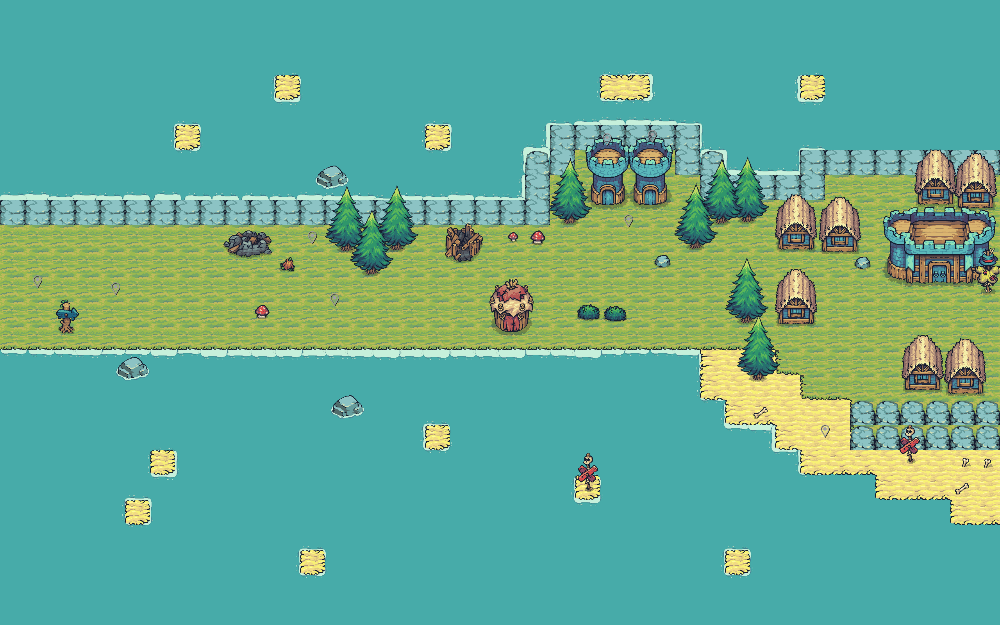

# Hunter - Thợ săn quái

Welcome to Hunter. An offline, 2D, survival game using Python
# Chức năng nổi bật
- **Đồ họa 2D** Bạn sẽ có trải nghiệm game 2D chân thật, cổ điển với âm nhạc du dương nhẹ nhàng, hoạt ảnh chất lượng, sống động.
<p align="center">
  <br>
  
  <br>
  <strong>Map 1</strong>  
</p>
<p align="center">
  <br>
  
  <br>
  <strong>Map 2</strong>  
</p>

- **Cuộc hội thoại với nhân vật** Một câu chuyện về vương quốc cùng tiên tri về thợ săn được kể lại bởi các nhân vật trong game một cách sinh động.

<p align="center">
  
  <br>
  <strong>Hình : Cuộc đối thoại với nhân vật</strong>  
</p>

- **Chế độ Change Mode** Tích hợp 2 hình thái nhân vật khác nhau: Archer và Warrior vào Player thông qua nút chuyển đổi đơn giản

<p align="center">
  
  <br>
  <strong>Hình: Player dưới dạng Warrior</strong>  
</p>

<p align="center">
  
  <br>
  <strong>Hình: Player tấn công dưới dạng Warrior</strong>  
</p>

<p align="center">
  
  <br>
  <strong>Hình: Player dưới dạng Archer</strong>  
</p>

<p align="center">
  
  <br>
  <strong>Hình: Player tấn công dưới dạng Archer</strong>  
</p>

# Hướng dẫn cài đặt
1. Đầu tiên, hãy fork repo game này về github của bạn. Sau đó, hãy chạy các câu lệnh Terminal sau:
```
git clone https://github.com/ten-ban/ten-du-an.git
cd game
```
2. Cài các thư viện cần thiết quâ file requirement.txt:
```
pip install -r requirements.txt
```
3. Chạy ứng dụng bnagwf câu lệnh
:
```
python main.py
```
# Cấu trúc thư mục
```
├── animation/
├── assets/
│    ├── fonts/
│    ├── music/
│    ├── sfx/
│    ├── tilesets/
│    └── sprites/
│
├── data/
├── engine/
├── maps/
├── module/
├── animation/
├── ui/
├── utils/
│
├── main.py
├── README.md
├── requirements.txt
```
# Đóng góp

- Dự án được làm bởi team 5 người: Nguyễn Gia Huy, Ngô Đăng Khoa, Nông Thị Nhật Lệ, Cao Thị Xuân Đạt, Liên Quốc Đại Tâm
- Dự án được hướng dẫn bởi TS. Trần Sơn Hải và TG. Lê Thanh Thoại

#Giấy phép
MIT License.